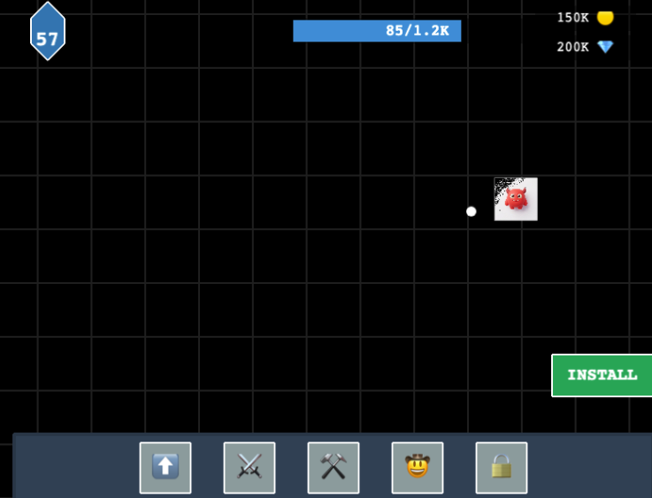
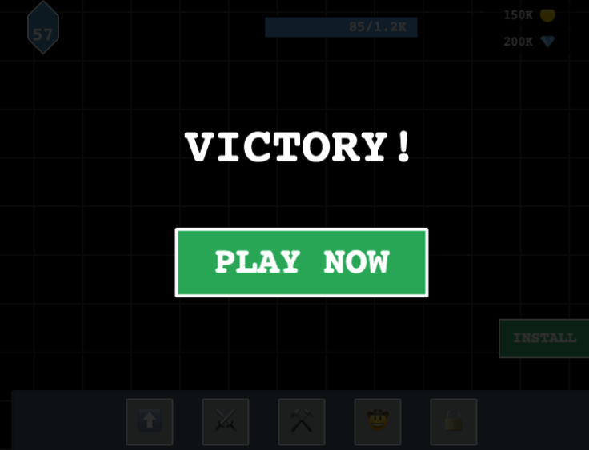

# XPHero Playable Ad MVP

<p align="center">
  
  
</p>

## 프로젝트 설명

이 프로젝트는 **XPHero 모바일 게임을 플레이어블 HTML5로 만드는 것을 AntiGravity를 통해서 얼마나 잘 만들 수 있는지 확인하기 위해** 진행된 프로젝트입니다.

**Reference Game:** [XPHero (Google Play)](https://play.google.com/store/apps/details?hl=en-US&id=io.supercent.weaponrpg)

**결론적으로, 이 프로젝트는 플레이어블 광고를 제작하는 데 있어 유의미한 결과를 얻지 못했다는 결론을 내렸습니다.**

## 개요
**Phaser 3**, **TypeScript**, **Vite**를 사용하여 제작되었습니다. 광고 네트워크 배포를 용이하게 하기 위해 단일 HTML 파일로 빌드되도록 설정되어 있습니다.

## 주요 기능
- **단일 파일 출력**: `dist/index.html` 파일 하나로 빌드됩니다 (약 1.2MB).
- **비주얼**: "Hyper Casual 3D" 스타일에 맞춰 GenAI로 생성한 에셋(플레이어, 적, 잔디)을 적용했습니다.
- **게임플레이**:
  - **이동**: 마우스/터치 드래그 또는 방향키/WASD 사용.
  - **전투**: 가장 가까운 적을 자동으로 공격.
  - **적**: 플레이어를 추격하는 적들이 무한히 생성됨.
  - **진행**: 킬 카운트 및 "LEVEL UP" 효과.
- **플레이어블 광고 요소**:
  - **CTA**: "INSTALL" 버튼이 항상 화면에 표시됨.
  - **엔딩 카드**: 20킬 달성 시 "VICTORY", 사망 시 "GAME OVER" 화면과 함께 "PLAY NOW" 버튼 표시.
  - **스토어 링크**: Google Play 스토어 페이지로 리다이렉트.

## 로컬 실행 방법
1. 의존성 설치:
   ```bash
   npm install
   ```
2. 개발 서버 시작:
   ```bash
   npm run dev
   ```
3. 터미널에 표시된 URL(보통 `http://localhost:5173`)을 엽니다.

## 빌드 방법
1. 빌드 명령어 실행:
   ```bash
   npm run build
   ```
2. 생성된 단일 HTML 파일은 `dist/index.html`에 위치합니다.
3. 이 파일을 브라우저에서 직접 열어 최종 광고를 테스트할 수 있습니다.

## 커스터마이징
- **게임 밸런스**: `Player.ts` 및 `GameScene.ts`에서 `speed`, `fireRate`, `spawnTimer` 등을 조절할 수 있습니다.
- **에셋**: 에셋은 `src/assets`에 위치합니다. `GameScene.ts`의 `processTexture` 메서드가 간단한 배경 제거를 처리합니다.
